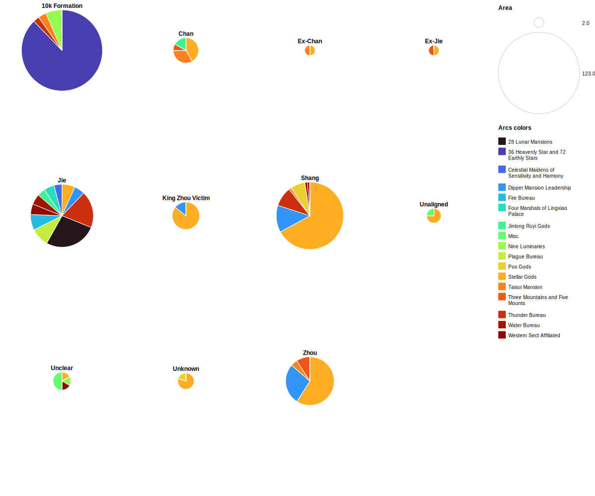

# Data Essay: The Investiture Analyzed

<i>Fengshen Yanyi</i> is a 100-Chapter Chinese vernacular novel published in the early 17th century. The story is a highly fictionalized narrative of the toppling of the Shang dynasty by the Zhou, where both sides are assisted by supernatural beings such as Daoist immortals and yaoguais. At the end of the novel, almost every character who perished in the war are deified as gods of the new Celestial Bureaucracy, and their names are listed in Chapter 99.

This is an analysis of said list, based on the "common version" found in the 1891 edition of the novel. I choose this version because the original Ming novel has a different list of names, but most names on that list replaced by the 1891 edition are random ones who have not appeared in-story. The first visualization divides the entire Investiture by faction, while the second visualization divides the population makeup of each Celestial Bureau listed in Chapter 99 by factions.

## First viz

First, my definitions for each faction:

Chan-aligned - Someone who is an immortal of the Jade Emptiness Palace, a disciple of a Chan Daoist immortal, or an allied immortal fighting on the Chan Sect’s behalf when they are deified.

Jie-aligned - Someone who introduces themselves as a Jie Daoist/immortal of the oceanic islands, disciple of a Jie immortal, or wielding treasures identified as Jie-crafted by other characters despite never revealing their masters.

Zhou-aligned - A mortal whose loyalty lies with the Zhou faction when they are deified. For my sanity’s sake, I’m not coming up with a special category for ex-Shang folks who switched their allegiance.

Shang-aligned - Like Zhou-aligned, but for the Shang side. Even though they may be yaoguai, wield magical treasures, or know Daoist arts, if they don’t identify with the Jie Sect specifically, I’m counting them as Shang-aligned instead of Jie-aligned.

King Zhou Victims - Characters whose death are directly related to King Zhou's orders, or fear of repercussions from King Zhou.

Unclear - This character certainly has a faction, but I don't know for sure because of ambiguities in the text.

Unaligned - This character doesn't belong to any of the above factions.

Unknown - There is no information on the character because they have never appeared in-story prior to Chapter 99.

Ex-Jie: Someone who’s a Jie Sect member or has studied under a Jie Daoist, but whose allegiance no longer lies with Jie/Shang when they are deified.

Ex-Chan: Same as Ex-Jie, but with some differences. If they never join the Chan Sect in the first place, but become the sidekicks of Ex-Chan characters, then I count them as Shang-aligned.

10k Formation: Characters who are labelled as casualties of the Ten Thousand Immortal Formation in Chapter 99.

This chart divides the total population of the Investiture by the aforementioned factions. I use RawGraphs for the Pie Chart, but for some reason, the site does not allow me to show both the legends——labels regarding which color corresponds to which faction——and the main body of the chart. If one is visible after I tweak the chart size, the other is either invisible or too small. 

Thus, I use the online editor PineTools to merge a screenshot of the legends together with a jpg I downloaded from RawGraphs. Also, I don't think the iframe template given in the Data Essay Repo works, so I just inserted the images using the same codes given in the next section.

.jpg)

[The CSV file used to generate the graph](TotalNumberChart.csv)

There are actually 371 names listed in Chapter 99, instead of the 365 mentioned in-story. The majority of them are Jie/Shang-aligned, which fits the impression one gets from reading the novel, and the characters labelled as "10k Formation" casualties in Chapter 99 are just filler names added to match the 365 quota.

I have also created an Excel sheet that lists every character on the Investiture with additional categories about 1) whether their deaths are described in-story, 2) if they are replacing an entirely different name on the Shu Edition Investiture, 3) whether their death is described in-story but their names do not appear in Chapter 99, and 4) whether their names only appear in Chapter 99 and nowhere else in the novel.

However, RawGraph doesn't handle the formatting well, so I give up trying to create a visualization and choose to upload the CVS file into the Github repository as reference. Here is the link: [The Full List](TheList.csv)

## The Investiture, by Celestial Bureaus

### Population makeup of each Celestial Bureau, divided by factions

Chapter 99 itself divides the names by the Celestial Bureaus they will be working for after deification. Which poses a problem, because some of the "Bureau Titles" only consists of a single character and their job position.

As such, I decide to put every "bureau" with less than 3 people in it into the Misc. category. There are also a few characters who are described in-story as "guardians of the Western Sect" while Jiang Ziya, the person in charge of the Investiture Project, is reading out their new job titles, so I'm classifying these characters as "Western Sect Affiliated".

For your knowledge, Western Sect is basically the novel's Buddhism stand-in in a Daoist robe.

## Bibliography
